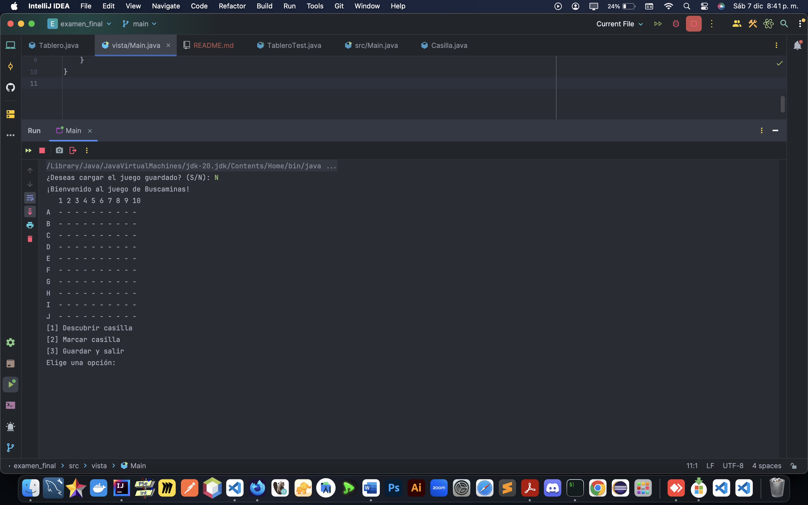

# **Buscaminas en Consola**  
Este proyecto es una implementación en consola del clásico juego de **Buscaminas**, desarrollado como examen final para la asignatura de **Programación Orientada a Objetos**. El juego utiliza principios de programación orientada a objetos como encapsulamiento, herencia y manejo de excepciones.  
 


---

## **Características**
- 🎮 **Tablero dinámico**: Tablero de 10x10 con 10 minas colocadas aleatoriamente.
- 🛠️ **Funciones del jugador**:  
  - Descubrir casillas.  
  - Marcar casillas sospechosas como minas.  
  - Guardar y cargar el estado del juego para continuar más tarde.  
- 💥 **Condiciones de victoria y derrota**:
  - Derrota: Descubrir una mina.  
  - Victoria: Descubrir todas las casillas seguras.  
- 🚨 **Manejo de errores**:  
  - Validación de entradas.  
  - Excepciones personalizadas como `CasillaYaDescubiertaException` y `CoordenadaInvalidaException`.  

---

## **Requisitos del Sistema**
- **Java**: Versión 11 o superior.  
- **JUnit**: Versión 5 para ejecutar pruebas unitarias.  
- **IDE**: (Opcional) IntelliJ IDEA, Eclipse u otro IDE compatible.  

---
## Instalación

Para clonar este proyecto y empezar a trabajar con él, sigue los siguientes pasos:

1. Clona el repositorio:

   ```bash
   https://github.com/Alberthluiiz/Guillen_Luis_Examen_final.git

---

## **Capturas del Juego**  
### Tablero Inicial  
```plaintext
   1 2 3 4 5 6 7 8 9 10
A  - - - - - - - - - -
B  - - - - - - - - - -
C  - - - - - - - - - -
D  - - - - - - - - - -
E  - - - - - - - - - -
F  - - - - - - - - - -
G  - - - - - - - - - -
H  - - - - - - - - - -
I  - - - - - - - - - -
J  - - - - - - - - - -